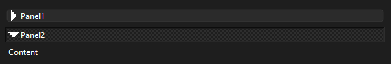
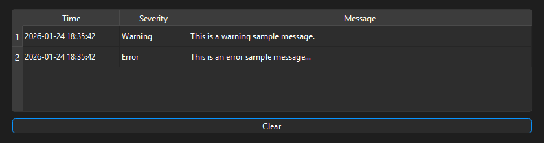
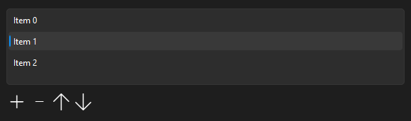
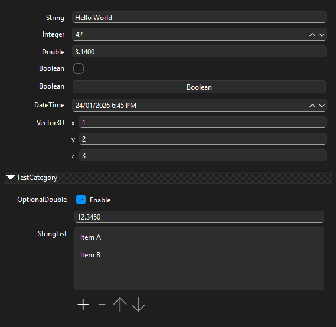

# Skybolt Widgets
**A collection of useful widgets, data models, and utility functions for the Qt framework.**

---
## Features
### Widgets
#### CollapsiblePanelWidget

A widget that can be expanded and collapsed vertically. When expanded, the content widget appears. When collapsed, only the widget's title appears.

#### ErrorLogWidget

Displays an error message log. Messages have a timestamp, have a severity level (error, warning, info etc), and message text. Messages can be cleared by pressing the "Clear" button. Backed by an `ErrorLogModel`.

#### LatestErrorWidget

Shows the latest error message from a log. The user can click the 'expand' button to the complete error log presented in an `ErrorLogWidget`. Designed to be added to `QStatusBar`.

### ListEditorWidget

Widget for editing a list of items. Items can be added, removed, or moved up and down in the list.

#### PropertyEditorWidget

Widget for displaying a list of editable properties, similar to property editors provided by popular content creation tools (Blender, Unreal Engine etc). Properties are backed by `PropertiesModel` which stores a list of `QtProperty` objects.

### TimelineWidget

Provides a multimedia-player style timeline with a draggable time slider. An optional 'marked range' can be displayed, for example to indicate a buffered region of the timeline.

### TimeControlWidget

Provides multimedia-player style buttons for play, pause, backward and forward.

### Data Models
#### PropertiesModel
Stores a list of `QtProperty` objects representing named properties of various data types. Designed to be displayed with `PropertyEditorWidget`. Properties can be optionally backed by the [skybolt-reflect](https://github.com/prograda/skybolt-reflect) C++ runtime reflection library by calling `addReflPropertiesToModel`.

#### SyncedListModel
An auto-synchronizing model that reconciles its state with an external collection via snapshot diffing. Instead of resetting the entire model, it identifies and applies only the specific deltas (insertions and deletions) required to match the latest snapshot.

#### TreeItemModel
Implements `QAbstractItemModel` to provide an object oriented interface that simplifies management of an item hierarchy, intended for display with `QTreeView`.

### Utility functions
#### Qt class helpers
A variety of utility functions are provided to simplify usage of standard Qt classes including:
* QDialog
* QLayout
* QMenu
* QScrollArea
* QTimer

#### RecentFileMenuPopulator
A utility class that populates a QMenu with names of recently opened files.

---
## Building
This library can be built using [Conan](https://conan.io) and [CMake](https://cmake.org).

The [Conan recipe](conanfile.py) provides a list of build dependencies. These dependences are aquired automatically if building with conan. The `skybolt-reflect` package is an optional dependency which provides runtime reflection for the `PropertiesModel` class.

---
## License
This project is licensed under the MIT license - see the [License.txt](License.txt) file for details.

---
## Contact
To submit a bug report, please [raise an issue on the GitHub repository](https://github.com/Prograda/skybolt-widgets/issues).

For business enquiries, please use our [contact form](https://prograda.com/contact).